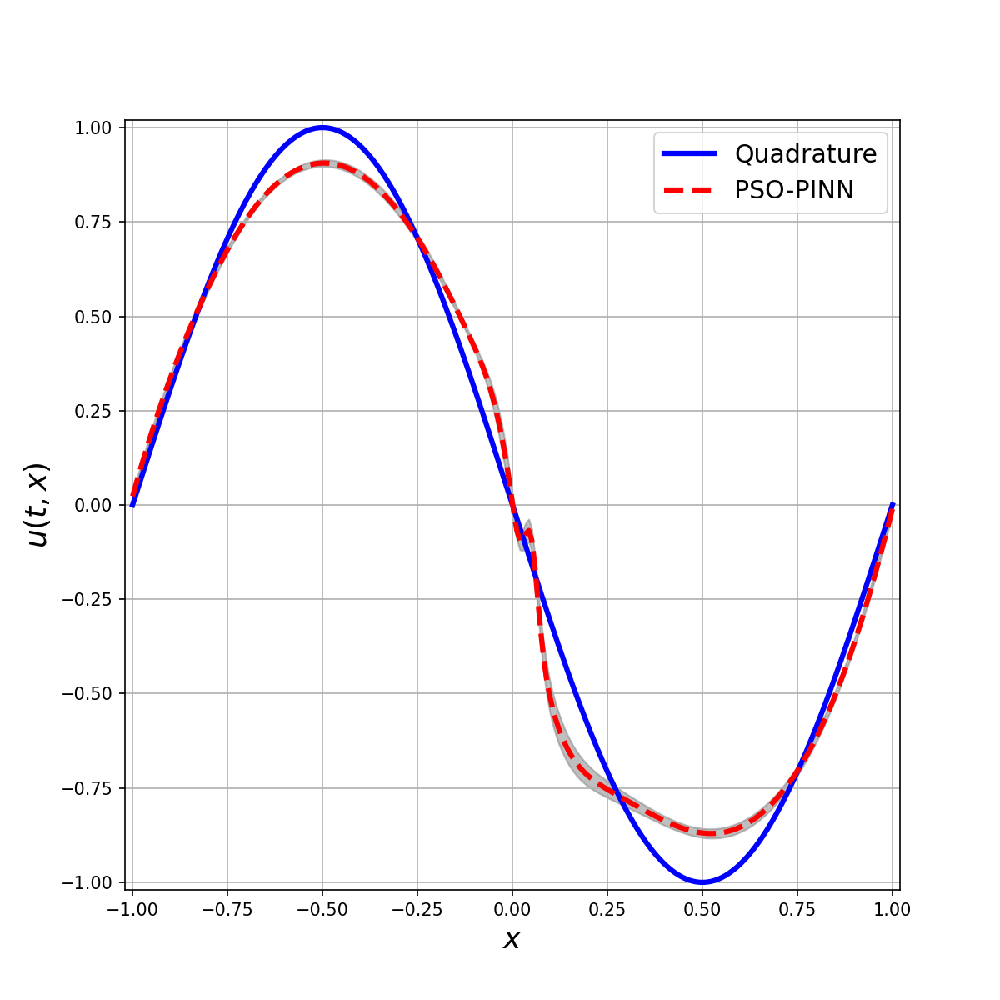
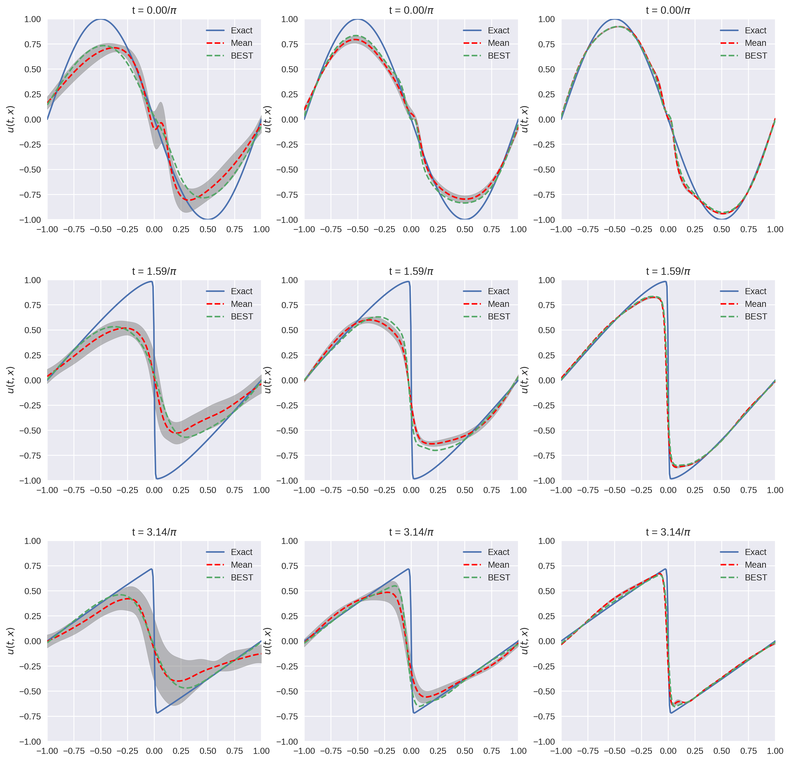
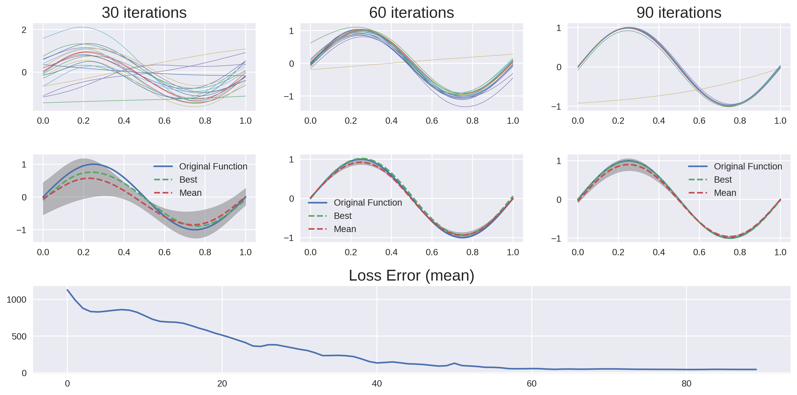

# Physics-Informed Neural Networks Trained with Particle Swarm Optimization

_Physics-informed neural networks (PINNs) have recently emerged as a promising application of deep learning in a wide range of engineering and scientific problems based on partial differential equation models. However, evidence shows that PINN training by gradient descent displays pathologies and stiffness in gradient flow dynamics. In this paper, we propose the use of a hybrid particle swarm optimization and gradient descent approach to train PINNs. The resulting PSO-PINN algorithm not only mitigates the undesired behaviors of PINNs trained with standard gradient descent, but also presents an ensemble approach to PINN that affords the possibility of robust predictions with quantified uncertainty. Experimental results using the Poisson, advection, and Burgers equations show that PSO-PINN consistently outperforms a baseline PINN trained with Adam gradient descent._

The full paper is available [here](https://arxiv.org/pdf/2202.01943.pdf).

> #### All contents in this repo is _WORK IN PROGRESS_. We may have major updates on the code.

## [Getting Start](#setup-virtual-environment)

## Some preliminary results:

### Allen-Cahn Equation:


The Allen-Cahn equation is a notary example where gradient descent-based optimizers fail to find a good solution. In this example, even using 10 data points (10 space points over time) it has a hard time finding the optimal solution. The PSO-PINN can alleviate this, smoothing the negative influence of the gradient-based model. Also, notice the variance increasing where the solution is not quite correct, representing the algorithm uncertainty on these points.

### Burgers Equation:

 

The final result is on the left image and the training on the right. Each column on the right image represents a snapshot of the training. The first column has 2k iterations, the second column 4k iterations, and the last one 6k iterations. Note how the variance (uncertainty) decreases over the iterations.

### Poisson Equation:



Notice how the ensemble converges over the iterations. After a few iterations, we have a "collective agreement", which means that most of the swarm agrees with the solution. The variance can be interpreted as a measure of the ensemble's uncertainty in relation to the given solution.

## Setup virtual environment

Create environment:

```bash
python3 -m venv --system-site-packages ./.venv
source ./.venv/bin/activate
```

Install requirements:

```
pip install -r requirements
```

Install the project module (on the root folder):

```bash
pip install -e ./src
```

## Citation

```
 @article{davi2022pso,
  title={PSO-PINN: Physics-Informed Neural Networks Trained with Particle Swarm Optimization},
  author={Davi, Caio and Braga-Neto, Ulisses},
  journal={arXiv preprint arXiv:2202.01943},
  year={2022}
}
```
